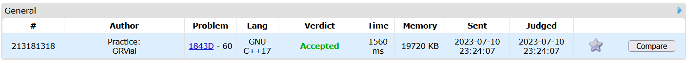

# Exercícios

**Conteúdo da Disciplina**: PD 

## Alunos
| Matrícula | Aluno |
| -- | -- |
| 19/0014032  | Guilherme Rogelin Vial |
| 19/0033088  | Lucas Braun Vieira Xavier |

## Sobre

Exercícios do Codeforces e do AtCoder resolvidos que utilizam algoritmos de Programação Dinâmica.

[1843D - Apple Tree](https://codeforces.com/problemset/problem/1843/D)

*[Link para submissão](https://codeforces.com/contest/1843/submission/213181318)*

[abc303_d - Shift vs. CapsLock](https://atcoder.jp/contests/abc303/tasks/abc303_d)

*[Link para submissão](https://atcoder.jp/contests/abc303/submissions/43466759)*

[abc306_d - Poisonous Full-Course](https://atcoder.jp/contests/abc306/tasks/abc306_d)

*[Link para submissão](https://atcoder.jp/contests/abc306/submissions/43467805)*

## Instalação e execução

Basta compilar os códigos em C++ e rodar.
